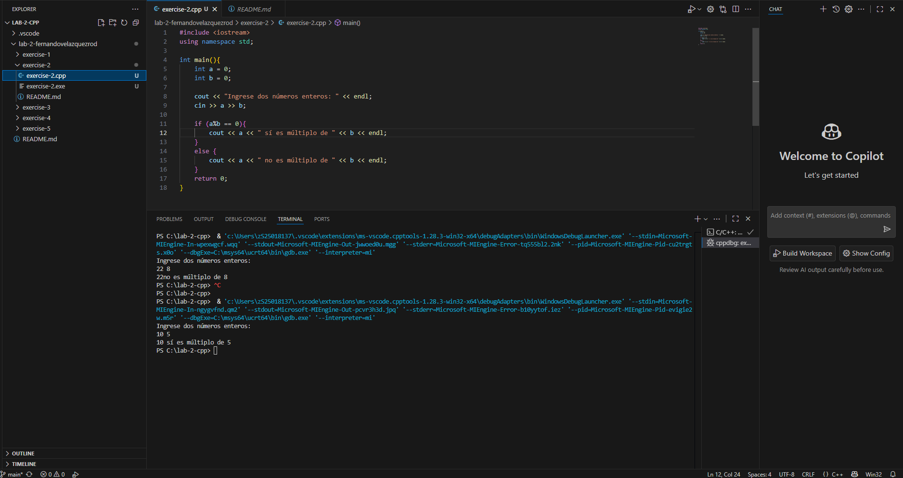
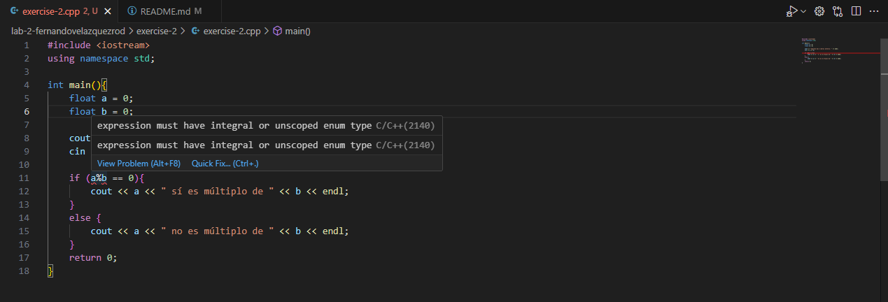
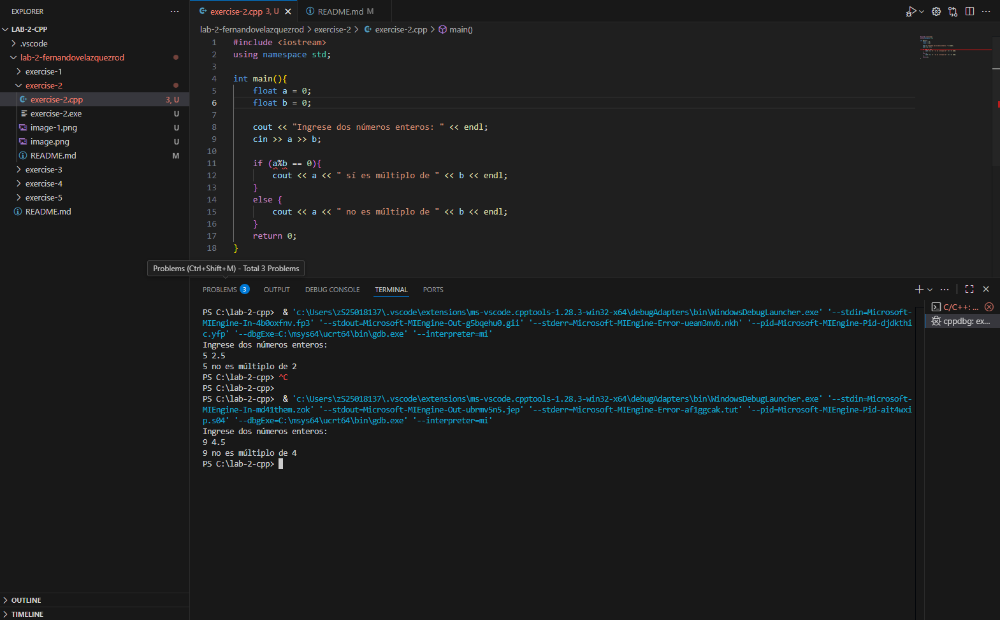
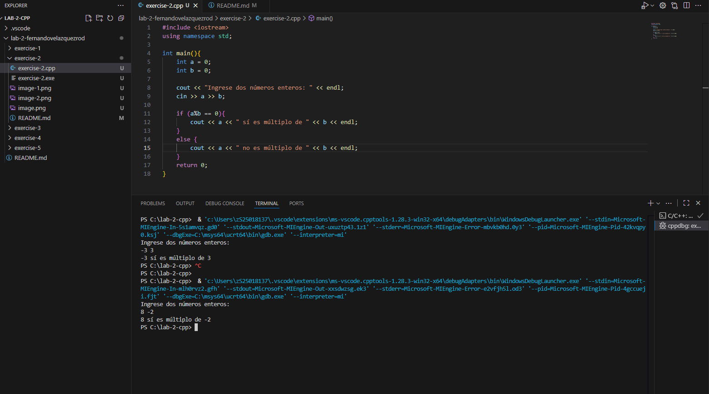
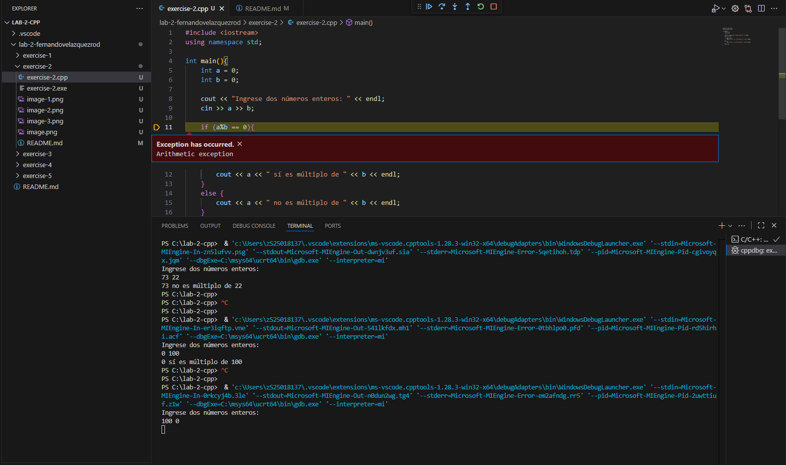
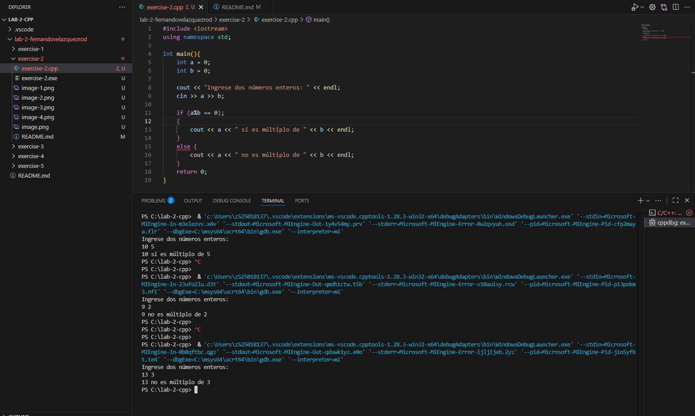
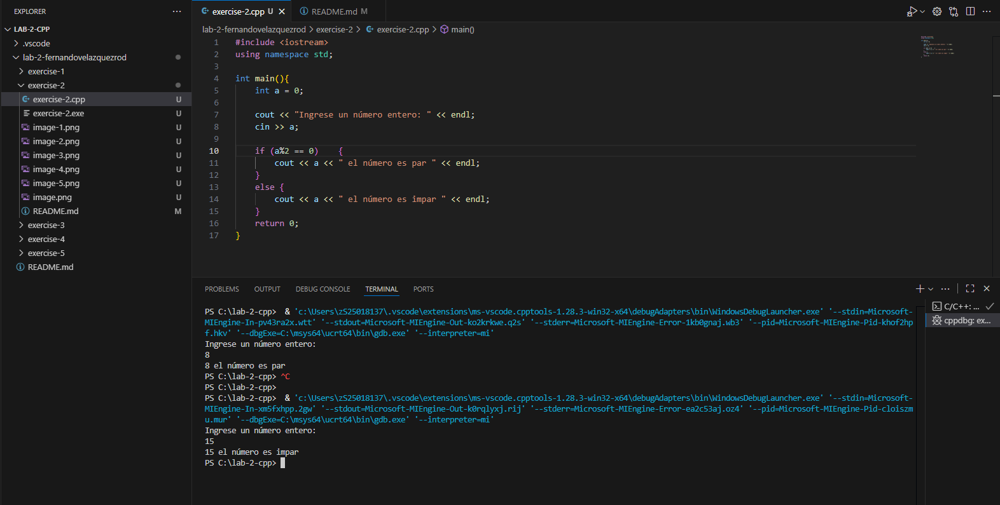

# Ejercicio de laboratorio 2 – Múltiplos

## Descripción

Escriba un programa que lea en dos números enteros y determine e imprima si el primero es un múltiplo del segundo. [Sugerencia: use el operador de módulo.]

```cmd
Ingrese dos enteros: 22 8
22 no es un múltiplo de 8
```

## Contesta las siguientes preguntas

1. ¿Se puede utilizar el operador de módulo con operandos no enteros? No se puede utilizar, aunque en teoría los números sin son múltiplos, marca que es error y que no son múltiplos 
¿Se puede usar con números negativos? Sí permite utilizarlo con números negativos
Supongamos que el usuario ha introducido los siguientes conjuntos de números. Para cada serie, ¿qué produce en la tercera columna? Si hay un error, explique por qué.

   | Entero 1 | Entero 2 | Expresión        | Salida |
   | -------- | -------- | ---------------- | ------ |
   | 73       | 22       | cout << 73 % 22; |        |
   | 0        | 100      | cout << 0 % 100; |        |
   | 100      | 0        | cout << 100 % 0; |        |
   | -3       | 3        | cout << -3 % 3;  |        |
   | 9        | 4.5      | cout << 9 % 4.5; |        |
   | 16       | 2        | cout << 16 % 2;  |        |

   Marca un error en la tercera fila (100 % 0) debido a que es un error matemático pues no puedes dividir un número entre 0

2. ¿Qué pasa si colocamos un punto y coma (;) después del final de la expresión de condición de una declaración if?
      Nos marca un error en el 'else', diciendo que hay un 'else' sin un 'if' antes de, sin embargo se ejecuta de manera normal
3. Modifique el programa para determinar si un número ingresado es par o impar. [Nota: Ahora, el usuario necesita ingresar solo un número.]

## ✅ Resultado

Primera ejeución


Con números no esnteros




Con números negativos


Error de la tercera columna (100 & 0)


Agregando el (;)


Cambian el programa para determinar si el número es par o impar
